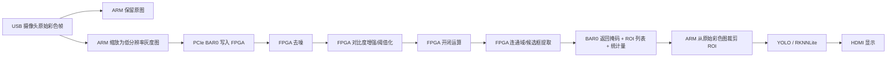

# FPGA 预处理第二版设计

## 1. 设计目标

第二版 FPGA 预处理的目标不是“把 YOLO 前处理全部搬进 FPGA”，而是：

1. 保留 ARM 侧原始彩色图，避免破坏后续 YOLO 需要的纹理和颜色信息。
2. FPGA 侧用低分辨率灰度图快速做“候选区域提取”。
3. ARM 只对 FPGA 给出的候选区域做后续 YOLO 推理，从而减少无效计算。
4. 让整个方案更贴合赛题里“FPGA 负责关键预处理与先验提取”的要求。

结论先说清楚：

- 不建议优先做“RGB 分通道去噪后整帧送 YOLO”
- 更建议做“灰度去噪 + 二值/边缘 + 形态学 + 候选框提取”

原因是：

1. RGB 分通道去噪会明显增加 FPGA 资源和带宽占用。
2. 过度修改整帧输入，反而可能伤到 YOLO 的泛化能力。
3. 对比赛目标来说，先找到疑似车牌/车辆区域，比改善整帧观感更有价值。

## 2. 第二版总思路

## 3. 推荐的第二版预处理链

### 阶段 A：轻量去噪

建议优先顺序：

1. `3x3 高斯滤波`
2. `3x3 中值滤波`

推荐默认先上 `3x3 高斯`，原因：

1. 资源开销更小，更容易流水化。
2. 对摄像头噪声和轻微压缩噪声有抑制作用。
3. 不会像强平滑那样过度抹掉边缘。

什么时候再加 `3x3 中值`：

1. 如果现场有明显椒盐噪声
2. 如果车牌边缘附近有大量离散亮点/暗点

因此第二版建议：

- 先实现 `gauss3x3`
- 中值滤波作为可选模式保留到第二阶段或第三阶段

### 阶段 B：亮度鲁棒化

推荐做法：

1. 保留当前全局阈值二值化
2. 增加一个简易亮度增强分支

建议不要一上来就做完整自适应阈值，先做这两类轻量方案：

1. `线性拉伸 / LUT gamma`
2. `Sobel 边缘强度图 + 阈值`

这里更推荐的主线是：

- 模式 0：原始灰度直接阈值
- 模式 1：高斯后阈值
- 模式 2：Sobel 梯度幅值后阈值

原因：

1. 车牌、车辆轮廓、文字区域都对梯度信息敏感。
2. 比纯亮度阈值更抗阴影和局部反光。
3. 实现复杂度比自适应阈值低很多。

### 阶段 C：形态学清理

建议优先实现：

1. `开运算`
2. `闭运算`
3. `开 + 闭`

推荐默认：

- 车牌候选提取优先 `开 + 闭`

作用：

1. 开运算去小噪点
2. 闭运算连通被切碎的字符或牌照边缘

### 阶段 D：候选区域提取

这是第二版最关键的新增能力。

推荐 FPGA 端输出：

1. 二值掩码
2. `active_pixels`
3. 最多 `4` 或 `8` 个候选框
4. 每个候选框的面积、宽高比、置信分数

候选框筛选建议：

1. 去掉面积过小区域
2. 去掉过细或过扁区域
3. 对宽高比做简单约束
4. 按面积或得分排序，只返回前 `N` 个

如果暂时不想一次做完整连通域标记，可以先做一个“简化版”：

1. 从二值图做横纵投影
2. 先找若干活跃区域带
3. 再在带内找外接矩形

但从长期看，还是建议最终上“轻量连通域 + 外接框”。

## 4. 为什么不优先做 RGB 分通道去噪

对你当前方案，这条路优先级不高。

### 不优先的原因

1. 你当前摄像头图像本身已经比较清晰，瓶颈不在彩色噪声。
2. FPGA 现在是单 BAR 小窗口结构，做三通道会放大带宽压力。
3. 后面 YOLO 最好吃原始彩色图，而不是被 FPGA 深度改造后的彩色图。
4. 分通道去噪更适合做颜色分割任务，比如红绿灯、车道锥桶颜色识别。

### 什么情况下再考虑 RGB 分通道

1. 你后面要做红绿灯检测
2. 你要在 FPGA 上直接做颜色先验分支
3. 现场光照导致颜色分量差异非常关键

所以当前主线建议：

- FPGA 主处理链继续走灰度
- 彩色原图保留在 ARM 侧给 YOLO

## 5. 第二版寄存器扩展建议

当前第一版已经有：

1. `CONTROL`
2. `FRAME_WIDTH`
3. `FRAME_HEIGHT`
4. `THRESHOLD`
5. `ROI_XY`
6. `ROI_WH`
7. `MORPH_CFG`
8. `FRAME_BYTES`

第二版建议新增：

1. `0x080 PREPROC_CFG`
2. `0x090 FILTER_CFG`
3. `0x0A0 CCL_CFG`
4. `0x0B0 ROI_COUNT`
5. `0x0C0 ~ 0x0F0 ROI0 ~ ROI3`

推荐编码如下。

### PREPROC_CFG

- bit0: `enable_threshold`
- bit1: `invert`
- bit2: `enable_sobel`
- bit3: `use_gradient_mag`
- bit5:4: `denoise_mode`
  - `00`: off
  - `01`: gauss3x3
  - `10`: median3x3
  - `11`: reserved
- bit7:6: `morph_mode`
  - `00`: off
  - `01`: open
  - `10`: close
  - `11`: open_then_close

### FILTER_CFG

- bit7:0: `threshold_low`
- bit15:8: `threshold_high`
- bit23:16: `min_area_cfg`
- bit31:24: `aspect_cfg`

### CCL_CFG

- bit7:0: `max_roi_count`
- bit15:8: `min_width`
- bit23:16: `min_height`
- bit31:24: `score_mode`

### ROIx

每个 ROI 用一个 128bit word，便于 ARM 侧直接按 16 字节读取：

- dword0: `{y, x}`
- dword1: `{h, w}`
- dword2: `area`
- dword3: `score`

这样软件侧非常容易解析，也方便答辩展示“FPGA 不只是给掩码，还给 ROI 先验”。

## 6. 第二版状态头建议

除了当前已有的：

1. `busy`
2. `done`
3. `error`
4. `width`
5. `height`
6. `frame_counter`
7. `threshold`
8. `active_pixels`

建议再加：

1. `roi_count`
2. `largest_area`
3. `largest_bbox_w`
4. `largest_bbox_h`
5. `preproc_mode`

这样 ARM 侧可以先看状态头再决定要不要继续跑 YOLO。

## 7. 第二版模块划分建议

建议把大模块拆成下面几个子模块，而不是继续把所有逻辑堆在一个 always 块里：

1. `preprocess_register_bank_v2`
   负责配置寄存器和状态寄存器
2. `line_buffer_3x3`
   负责 3x3 窗口生成
3. `filter_core`
   负责高斯/中值/Sobel
4. `binary_morph_core`
   负责阈值、开闭运算
5. `roi_extract_core`
   负责候选框提取和排序
6. `result_pack_core`
   负责把状态头和 ROI 结果映射回 BAR0

## 8. 结合你当前工程的最稳落地顺序

第二版不要一步全加满，建议分 3 个小版本推进。

### V2.1

先在当前第一版基础上增加：

1. `gauss3x3`
2. `sobel/gradient`
3. `morph_mode`

输出仍然只保留：

1. 掩码
2. `active_pixels`

目标：

- 先把掩码质量提高

### V2.2

再增加：

1. `roi_count`
2. 前 `4` 个候选框
3. 面积/宽高比筛选

目标：

- ARM 开始基于 ROI 裁图，再喂 YOLO

### V2.3

最后再做：

1. 候选框排序优化
2. 更多统计量
3. 连续帧稳定策略

目标：

- 提高现场鲁棒性

## 9. 对比赛答辩最加分的表述

你后面可以这样讲：

1. FPGA 不直接替代 YOLO，而是负责实时先验提取。
2. ARM 保留原始彩色图，保证深度模型输入质量。
3. FPGA 输出低成本、高实时性的候选区域和掩码。
4. YOLO 只在候选区域上运行，从而兼顾实时性与精度。

这套说法比“FPGA 只是做个二值化”要强很多，也比“把整帧都交给 FPGA 去修图”更合理。

## 10. 我建议你下一步真正开工的内容

如果按工程推进优先级排，我建议马上做：

1. 在当前 `morph_cfg` 基础上先重定义 bit 字段
2. 先实现 `gauss3x3`
3. 再实现 `open_then_close`
4. ARM 侧先验证掩码质量是否提升
5. 然后再加 `ROI0 ~ ROI3`

当前最优先的一句话总结：

**第二版的核心不是分彩色通道，而是让 FPGA 成为“候选区域提取器”。**

## 11. 当前代码实现状态

为了先通过综合并尽快上板，当前工程代码里先落的是一个 **V2.1-lite**：

1. 保留了第二版 `morph_cfg` 的模式位编码
2. 先实现轻量平滑、轻量梯度和轻量形态学
3. 重点是先看掩码质量是否比第一版阈值化更好

也就是说：

- 文档前面的链路仍然是目标架构
- 当前代码版本是面向“先上板验证”的资源收缩版
- 后面如果板上效果正确，再继续往真正的二维 `line buffer` 版推进
