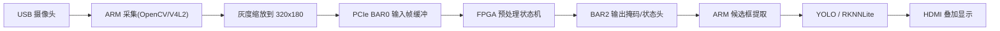

# 总体方案

## 1. 方案定位

本方案采用 `RK3568 + FPGA` 的异构协同结构：

1. ARM 侧负责设备管理、USB 摄像头采集、YOLO 推理、结果融合与 HDMI 显示。
2. FPGA 侧负责图像预处理、二值掩码生成、候选区域先验和后续可扩展的数据搬运加速。

## 2. 第一版链路

## 3. 为什么第一版先不用 DMA 做全流程

现有 `pcie_dma_test_100h` 例程里，PCIe BAR 通路已经现成可用，而 DMA 还需要补齐：

1. 主机侧 DMA buffer 分配和物理地址管理。
2. FPGA DMA 命令下发时序。
3. 跨 4KB 边界切分。
4. ARM 侧驱动或用户态映射的稳定性验证。

所以第一版先用 BAR 做共享缓冲，把链路跑通。等功能闭环后，再升级到 DMA。

## 4. 地址映射

结合你板子当前 `lspci/resource` 结果，第一版统一改成 `单 BAR(resource0)` 方案。

### BAR0 / resource0

1. `0x000 ~ 0x0FF`
   控制寄存器 + 状态头。
2. `0x100 ~`
   主机写入输入灰度图。
   预处理完成后，主机从同一地址范围读出输出掩码。

所有寄存器按 `16 字节对齐`：

1. `0x000`
   `CONTROL`
   位 0: `start`
   位 1: `continuous`
   位 2: `clear_done`
2. `0x010`
   `FRAME_WIDTH`
3. `0x020`
   `FRAME_HEIGHT`
4. `0x030`
   `THRESHOLD`
5. `0x040`
   `ROI_XY`
6. `0x050`
   `ROI_WH`
7. `0x060`
   `MORPH_CFG`
8. `0x070`
   `FRAME_BYTES`

## 5. 当前推荐答辩说法

1. ARM 负责摄像头、YOLO、显示与业务调度。
2. FPGA 负责图像预处理与候选区域先验生成，减轻 ARM 负担。
3. 第一版采用单 BAR 共享窗口快速完成闭环验证。
4. 第二版复用现有 PCIe DMA 例程，把帧流升级到 DMA 高吞吐路径。

## 6. 第二版 FPGA 预处理设计

第二版预处理不建议优先走“RGB 分通道去噪”，而是建议走：

1. 灰度轻量去噪
2. 阈值/梯度增强
3. 开闭运算
4. 候选区域提取
5. ARM 基于 ROI 再跑 YOLO

详细设计见：

- `docs/fpga_preprocess_v2.md`
